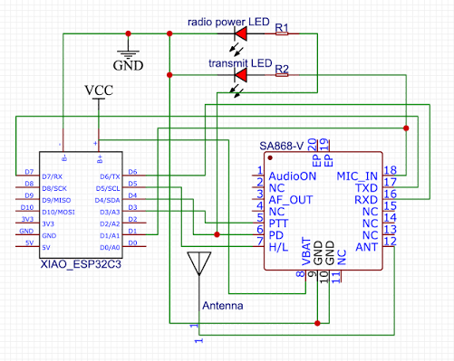

# rot13labs fox

   
  <b>Assembled rot13labs fox from <a href='https://rot13labs.com/'>rot13labs.com</a></b>

A simple, cheap ham radio fox (hidden transmitter) for foxhunts and cons, built on a Seeed Studio XIAO ESP32C3 and a NiceRF SA868 VHF module. The included firmware periodically transmits a short melody followed by a message in morse code.

Much of this code was copied from / inspired by [Yet Another Foxbox (YAFB)](https://github.com/N8HR/YAFB) by Gregory Stoike (KN4CK, N8HR). It has been stripped down and adapted for this hardware. All credit for the original project goes to Gregory Stoike.

This design has been adopted (and adapted) for foxhunts at hacker cons, ham radio events, and club activities, and has held up well in the field (and survived hot-plate reflow).

## Before you transmit

- **You must use your own callsign.** The default `callmessage` in `fox.ino` is a placeholder. Amateur radio regulations (FCC Part 97 §97.119 in the US) require you to identify your station. Edit `callmessage` to include your callsign before transmitting.
- **Check your local band plan.** 146.565 MHz is a common foxhunt frequency in the US, but verify it's appropriate for your area before use.
- **Never key up without an antenna (or dummy load) attached.** Transmitting into nothing can damage the SA868's final stage.
- A valid amateur radio license is required to operate this device legally. If you don't have a license yourself, find a buddy who does.

## Hardware

The hardware is (purposely) super simplistic. The c0ldbru/rot13 fox design is minimal to build, but easy to expand. The circuitry and BOM featured here are deliberately light because they're designed to be adapted to an event or use case. External LEDs were added to the radio power and transmit pins for easy troubleshooting. This design does not feature extras such as power switches or battery monitoring, but those are easy to add.

The XIAO ESP32C3 board used here has a built-in LiPo charge controller, and supports IEEE 802.11 b/g/n WiFi, and Bluetooth 5 (BLE) via external U.FL (U.FL-R-SMT1) connector. The XIAO ESP32C3s typically ship with a 2.4 GHz external antenna.

A note on the LiPo charge controller: this does **not** monitor the battery charge or LiPo health. See the notes in Battery monitoring below if you want to add that feature.

The full circuit looks like this:

   
  <b>Simplified fox circuit diagram with XIAO ESP32C3 and SA868 </b>

### Bill of materials

| Qty | Part | Notes |
|-----|------|-------|
| 1 | Seeed Studio XIAO ESP32C3 | Built-in LiPo charging |
| 1 | NiceRF SA868 (**VHF version**) | The UHF version will NOT work on 2m — check before ordering. Some boards will do BOTH 2m and 70cm. This is not guaranteed. |
| 1 | Antenna + PCB mount SMA connector |  |
| 1 | LiPo battery | 3.7 V single cell LiPo |
| 2 | LED | Power + TX indicators |
| 2 | Resistor, 330 Ω | LED current limiting |
| 2 | Resistor, 220 kΩ / 220 kΩ | OPTIONAL Battery monitor voltage divider (see below) |

### Wiring

| XIAO pin | GPIO | Connects to | Function |
|----------|------|-------------|----------|
| D1 | GPIO3 | SA868 MIC (audio in) | Melody / morse tone out |
| D3 | GPIO5 | SA868 PTT | LOW = transmit, HIGH = receive |
| D4 | GPIO6 | SA868 PD | LOW = power down, HIGH = powered |
| D5 | GPIO7 | SA868 H/L | LOW = low power, HIGH = high power¹ |
| D6 | GPIO21 | SA868 RXD | UART TX to radio |
| D7 | GPIO20 | SA868 TXD | UART RX from radio |
| 3V3 / GND | — | SA868 VCC / GND | Power |

¹ High power mode has caused issues in testing; the firmware defaults to low power.

### Battery monitoring (optional)

The XIAO ESP32C3 can *charge* a LiPo but has no built-in way to *read* its voltage.

If you want battery monitoring, it's possible with a simple two-resistor voltage divider from the battery's + terminal to an ADC pin; a pair of 220 kΩ resistors works well and keeps the constant drain on the battery negligible. See [Seeed's XIAO ESP32C3 wiki](https://wiki.seeedstudio.com/XIAO_ESP32C3_Getting_Started/#check-the-battery-voltage) for the wiring and example code.

This is **not** implemented in the firmware or PCB for this fox.

## Firmware

The firmware lives in `fox.ino` (radio control and main loop) and `morsemelody.ino` (melody playback and morse generation). It's commented liberally in the hope that it's useful for other SA868 projects. The SA868 is an awesome chip and deserves a lot more of a community than it currently has.

### Configuration

All the variables for controlling common behavior are at the top of `fox.ino`:

| Variable | Default | Meaning |
|----------|---------|---------|
| `callmessage` | *(placeholder)* | Message to send in morse — **put your callsign here** |
| `frequency` | 146.565 | TX frequency in MHz |
| `delayms` | 30000 | Pause between transmissions (ms) — also lets the SA868 cool down |
| `initial_delay` | 1000 | Delay before the first transmission (ms) |
| `volume` | 5 | SA868 volume, 1–8 |

### Libraries

In order to build this you will need `SoftwareSerial.h`. This is provided by the **EspSoftwareSerial** library included in this repo — move or copy the `EspSoftwareSerial` directory into your Arduino libraries directory (`~/Documents/Arduino/libraries/` on macOS). This bundled version is the one the firmware was tested against.

Alternatively, EspSoftwareSerial is available in the Arduino Library Manager, but newer versions there may behave differently than the bundled copy.

**Note:** the firmware uses the older ESP32 `ledc` API. If you get compile errors around `ledcSetup` or `ledcAttachPin`, install a 2.x version of the **esp32** core from the Boards Manager instead of the latest.

### Building and flashing

Last tested: September 8th 2026.

1. Install the [Arduino IDE](https://www.arduino.cc/en/software).
2. Add ESP32 board support: in **Preferences → Additional Board Manager URLs**, add
   `https://espressif.github.io/arduino-esp32/package_esp32_index.json`, then install **esp32 by Espressif Systems** from the Boards Manager (see the note in [Libraries](#libraries) if the build fails).
3. Install the **EspSoftwareSerial** library — copy the bundled `EspSoftwareSerial` directory from this repo into your Arduino libraries folder (see [Libraries](#libraries) above).
4. Select **Seeed XIAO ESP32C3** as the board.
5. Open `fox.ino` and edit the configuration (callsign, frequency, delay).
6. Hold the **B** (boot) button on the XIAO while plugging it in via USB-C. This puts it in boot-select mode, ready to receive firmware.
7. Hit **Upload**, then press **R** (reset) when it finishes to start the fox on the new firmware.

**Tip:** holding **B** while resetting also works as a "pause switch" — it halts transmissions while charging over USB-C.

## Contact

If you found one of my foxes at a con and want help updating the firmware, or are just looking to build one of your own, please feel free to reach out to me on twitter!
@c0ldbru

## License

* GPL-3.0 — see [LICENSE](LICENSE). 
* Original work by Gregory Stoike (KN4CK, N8HR)
* Melody playback adapted from [robsoncouto/arduino-songs](https://github.com/robsoncouto/arduino-songs)